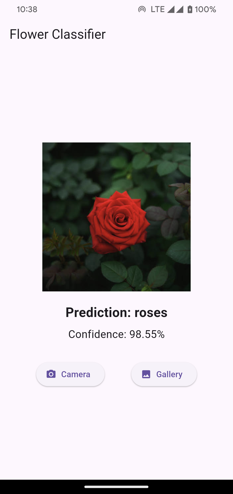

# 🌸 Flower Classification App (Flutter)

Flower Classification App is a cross-platform **Flutter application** that identifies flower types from images using an **offline Machine Learning model**.<br>
Users can **capture a photo using the camera** or **select one from the gallery**, and the app predicts the flower category **entirely on-device** using **TensorFlow Lite**.<br>
The application works **100% offline**, ensuring fast inference, privacy, and no dependency on internet connectivity.

---

## 🚀 Features (Core Features)

- ### 📷 Image Input

  - Capture flower images using the **device camera**
  - Select images from the **photo gallery**

- ### 🤖 Offline AI Prediction

  - On-device **image classification**
  - Real-time prediction without internet
  - Displays **predicted flower** name and **confidence score**

- ### 🌼 Supported Flower Categories

  - Dandelion
  - Daisy
  - Tulips
  - Sunflowers
  - Roses

- ### 📱 Clean & Simple UI

  - Material Design–based interface
  - Lightweight and responsive
  - Optimized for mobile devices

---

## 🤖 Machine Learning: Offline Image Classification

The app uses a **Convolutional Neural Network (CNN)** with **Transfer Learning** for accurate flower recognition.

### Model Details

- **Architecture:** MobileNetV2 (Transfer Learning)
- **Framework:** TensorFlow / Keras
- **Inference Engine:** TensorFlow Lite
- **Execution:** Fully offline (on-device)

### Dataset Used

- **TensorFlow Flowers** Dataset
- 5 flower classes
- Clean and well-labeled images

### Model Performance

- **Training Accuracy:** 96.45%
- **Training Loss:** 0.1480
- **Validation Accuracy:** 90.33%
- **Validation Loss:** 0.2875

### Offline ML Workflow

- Model trained in **Google Colab**
- Exported as **TensorFlow Lite (.tflite)**
- Loaded once at app startup
- Inference runs locally using Dart (no APIs, no cloud)

---

## 🛠️ Technologies Used

### App Development

- Flutter (Dart)

### Machine Learning

- TensorFlow
- TensorFlow Lite
- CNN with Transfer Learning (MobileNetV2)

### Flutter Packages

- `tflite_flutter`
- `image_picker`
- `image`

### Tools

- Android Studio
- VS Code
- Google Colab
- Flutter SDK

---

## 📦 Installation & Setup

1. **Clone this repository:**
   ```bash
   git clone https://github.com/Kalana-S/Flower-Classification-App.git
   cd Flower-Classification-App

2. **Get all dependencies:**
   ```bash
   flutter pub get

3. **Run the app:**
   ```bash
   flutter run

4. **(Optional) Build a release APK:**
   ```bash
   flutter build apk --release

---

## 💡 Usage

1. Open the app.
2. Choose **Camera** or **Gallery**.
3. Capture or select a flower image.
4. The app predicts:
    - **Flower name**
    - **Confidence percentage**
5. Results appear instantly — no internet required.

---

## 📸 Screenshots

### HomePage 


### Prediction Result 


---

## 🔒 Offline & Privacy-Friendly

- No internet connection required
- No data sent to servers
- All processing happens on the user’s device

---

## 🤝 Contribution

Contributions are welcome!<br>
If you have improvements or ideas, feel free to fork the repository and submit a pull request.

---

## 📜 License

This project is open-source and available under the **MIT License**.

---

💡 *Built with Flutter, powered by offline AI using TensorFlow Lite.*
